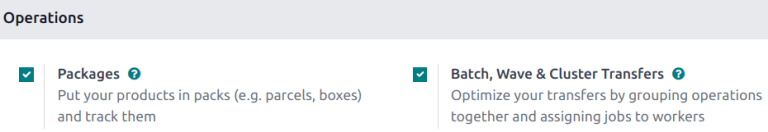
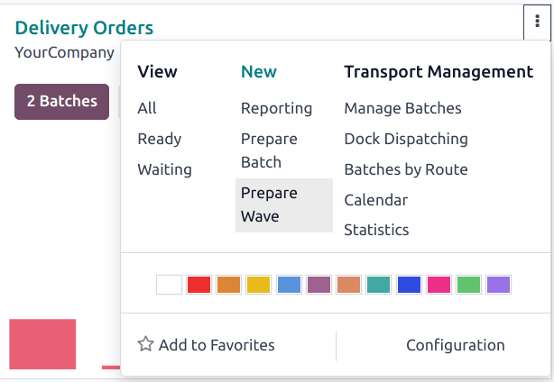
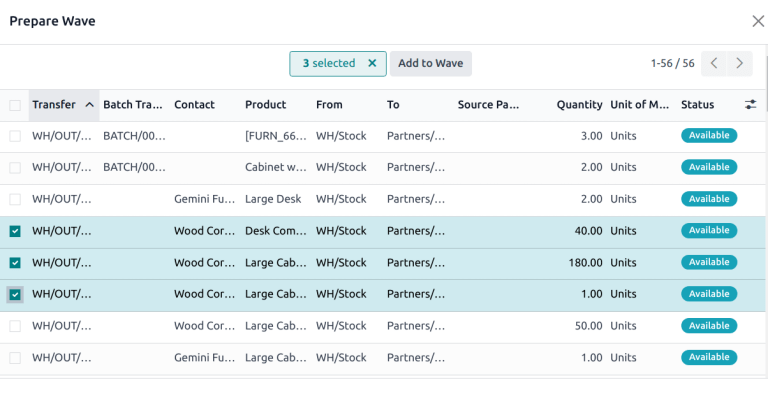

==============
Wave transfers
==============

While a batch transfer is a group of several pickings, a **wave transfer** only contains some parts
of different pickings. Both methods are used to pick orders in a warehouse, and depending on the
situation, one method may be a better fit than the other. In Odoo, wave transfers are batch
transfers with an extra step: transfers are split before being grouped in a batch.

Wave picking is ideal for warehouses that need to optimize the handling of high order volumes while
managing complex picking criteria. With wave transfers, orders are grouped into waves based on
factors like product location,category, or schedule shipping times. Each wave is assigned to a
different employee for the most efficient execution.

Wave picking is particularly useful for operations where multiple orders, or a single order, must be
picked across different waves. This approach enables flexible scheduling, allowing warehouses to
align picking activities with shipping deadlines, or resource availability.

Configuration
=============

To enable wave picking, begin by navigating to :menuselection:`Inventory --> Configuration -->
Settings`. In the :guilabel:`Operations` section, tick the :guilabel:`Batch, Wave & Cluster
Transfers` checkbox to enable the setting. Then, click :guilabel:`Save` to save the changes.

Create a wave
=============

Wave transfers can only contain product lines from transfers of the same operation type. To view
all the transfers and product lines in a specific operation, navigate to the
:menuselection:`Inventory app`. Find the desired Kanban card, then click the :icon:`fa-ellipsis-v`
:guilabel:`(vertical ellipsis)` icon to open the options menu.

Next, the :guilabel:`Storage Locations` and :guilabel:`Multi-Step Routes` options, under the
:guilabel:`Warehouse` heading, must also be checked on this settings page.

*Storage locations* allow products to be stored in specific locations they can be picked from, while
*multi-step routes* enable the picking operation itself.

Add products to a wave
----------------------

On the operations page, select the product lines that should be added in a new or existing wave.
Then, click :guilabel:`Add to Wave`.

.. tip::
   Use the :guilabel:`Filters` in the search bar to group lines with the same product, location,
   carrier, etc.

After that, a pop-up box appears.

To add the selected lines to an existing wave transfer, select the :guilabel:`an existing wave
transfer` option and select the existing wave transfer from the drop-down menu.

To create a new wave transfer, select the :guilabel:`a new wave transfer` option. If creating a new
wave transfer, an employee can also be set in the optional :guilabel:`Responsible` field. Once the
desired options are selected, click :guilabel:`Confirm` to add the product lines to a wave.

Process a wave
--------------

View wave transfers
===================

To view all wave transfers and their statuses, go to :menuselection:`Inventory --> Operations -->
Wave Transfers`. Wave transfers can also be viewed in the :guilabel:`Barcode` app by going to
:menuselection:`Barcode --> Batch Transfers`.
